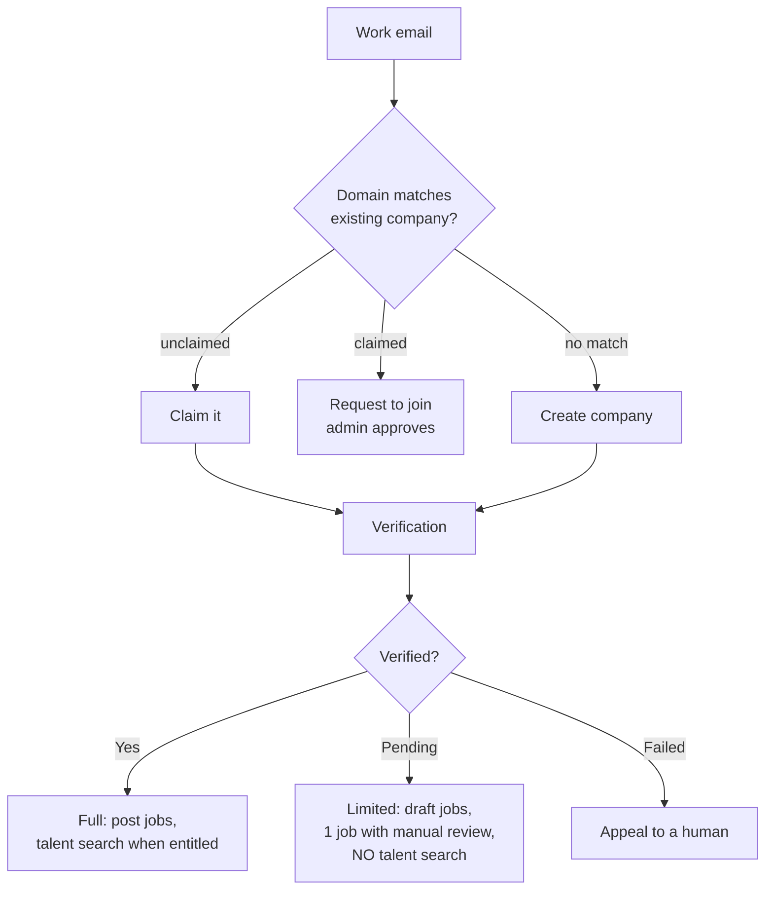

# A2 — Omelo Company Portal (Web)

**Phase 1 architecture document 2 of 4**
**Platform:** Next.js · desktop-first · SSR for public pages
**Audience:** a restaurant owner hiring one cook, and a logistics company hiring 400 drivers — in the same product

---

## 1. Design constraints

| # | Constraint | Consequence |
|---|---|---|
| **EC-1** | A founder hiring one person must post a job in under 10 minutes with no training | Wizard, sensible defaults, nothing mandatory that is not legally required |
| **EC-2** | A company hiring 400 people must not do 400 things by hand | Bulk actions, kanban, saved pipelines, templates |
| **EC-3** | Employers cannot hide from candidates | Stage names are free; candidate-visible states are not |
| **EC-4** | Requirements have a visible cost | Live pool count as requirements change |
| **EC-5** | Talent search is a privilege, never a default | Verification + entitlement + consent, all three |
| **EC-6** | Rejection needs a human | No automated rejection rules exist, and none will be built |
| **EC-7** | Desktop-first, mobile-limited | Mobile web: messages, candidate review, interview confirm. No job creation, no pipeline config. |

### 1.1 The constraint employers will push back on

EC-3 is the one that will be argued with, most likely when revenue is on the line. It is written
here, at architecture time, so the answer is already decided:

> Employers can name and order their stages however they want. They cannot invent a
> candidate-visible state, cannot suppress `viewed`, and cannot let an application go silent.

This is enforced by `job_stages.maps_to_state` (NOT NULL) and
`omelo_mark_application_viewed()`, not by policy. Losing employers who require opacity is an
expected and acceptable cost.

---

## 2. Navigation

```
+---------------------------------------------------------------+
| OMELO for Employers    [ ABC Logistics v ]   [ Sarah C. v ]   |
+------------+--------------------------------------------------+
| Dashboard  |                                                  |
| Jobs       |                                                  |
| Candidates |                                                  |
| Talent     |                                                  |
| Interviews |                  (content)                       |
| Messages   |                                                  |
| Offers     |                                                  |
| Employees  |                                                  |
|------------|                                                  |
| Company    |                                                  |
| Team       |                                                  |
| Analytics  |                                                  |
| Verify     |                                                  |
| Billing    |                                                  |
+------------+--------------------------------------------------+
```

`[ ABC Logistics v ]` is the company context switcher — required for agency recruiters working
several clients. **Every authorisation check evaluates against the active company context**, and
there is no cross-client visibility.

Navigation adapts to role: an Interviewer sees only Interviews and Messages; Finance sees only
Billing.

---

## 3. Onboarding and verification

| ID | Screen | Content |
|---|---|---|
| **C-01** | Sign up | Work email or phone |
| **C-02** | Verify contact | OTP |
| **C-03** | Company lookup | Domain match against existing companies |
| **C-04** | Claim / create / join | Three branches |
| **C-05** | Company details | Name, industry, size, founded, website |
| **C-06** | Locations | Address + map pin → `company_locations.geo` |
| **C-07** | Legal details | Registration number, tax ID, country |
| **C-08** | Verification | Domain + registry |
| **C-09** | Invite team | Optional, skippable |
| **C-10** | Dashboard | |



### 3.1 Two signals required

| Signal | Accepted evidence |
|---|---|
| Domain control | Work email at the domain **plus** DNS TXT record or well-known file |
| Corporate existence | Registration number checked against a registry, or manual review |

### 3.2 Talent search is never available before verification

An unverified account with talent-search access is a data-harvesting vector aimed at people who
can least afford the consequences. Job posting may proceed in a limited, reviewed form.
**Talent search may not.** This is a hard rule, not a growth trade-off.

Unverified companies get: an "unverified" badge on every job, reduced distribution, one active
posting, and mandatory manual review before publication.

---

## 4. Dashboard (C-10)

```
  ABC Logistics                        Aug 26, 2026

  Open jobs 24    Applications 1,842   New today 63
  Shortlisted 184  Interviews 42       Offers 8

  ! 12 applications have had no response for 5+ days
    Candidates can see this.            [ Review ]

  ACTIVE JOBS
    Delivery Executive       94 new    182 total   >
    Warehouse Assistant      31 new     88 total   >
    Fleet Supervisor          8 new     24 total   >

  NEEDS YOU
    3 interviews today                             >
    2 offers awaiting candidate response           >
    5 scorecards not submitted                     >

  YOUR RESPONSE BEHAVIOUR                  visible to candidates
    Response rate       91%
    Median response     3.2 days
    Hires on Omelo      84
```

Two deliberate choices:

**The stale-application banner is first.** Not buried in analytics. It says *"Candidates can see
this"* because they can, and because that is the fastest way to change employer behaviour.

**Response behaviour is on the dashboard, labelled as candidate-visible.** An employer who knows
their response rate is displayed on every job card behaves differently from one who does not.

---

## 5. Jobs

| ID | Screen |
|---|---|
| **C-20** | Job list — All / Draft / Pending review / Published / Paused / Expired / Closed |
| **C-21** | Job wizard (7 steps) |
| **C-22** | Job editor |
| **C-23** | Preview (exactly as a worker sees it) |
| **C-24** | Publish checks |
| **C-25** | Job performance |

### 5.1 The wizard

```
  1 Basics -> 2 The work -> 3 Requirements -> 4 Where
  -> 5 Pay & benefits -> 6 Schedule -> 7 Conditions & apply
```

| Step | Captures | Writes |
|---|---|---|
| **1 Basics** | Title, profession (auto-mapped, editable), category, department, openings | `jobs.title`, `profession_id`, `category_id`, `openings` |
| **2 The work** | Description, responsibilities. **Generate with Omelo AI** available. | `description`, `responsibilities` |
| **3 Requirements** | Skills + weight, experience range, education, licences, credentials, languages, adaptive attributes | `job_skills`, `job_licenses`, `job_languages`, `job_credentials`, `job_attribute_requirements` |
| **4 Where** | Location + map pin, workplace type, relocation, visa sponsorship | `location_id`, `geo`, `workplace_type`, `visa_sponsorship` |
| **5 Pay & benefits** | Min/max, **period**, currency, basis, negotiable, overtime, benefits | `pay_*`, `job_benefits` |
| **6 Schedule** | Work type, shifts, hours/week, days, start date, duration | `work_type`, `shift_types`, `hours_per_week`, `start_date` |
| **7 Conditions & apply** | Physical requirements, uniform, own tools, own vehicle, application method, quick apply, questions, documents | `physical_requirements`, `application_method`, `quick_apply_enabled`, `job_questions`, `job_documents_required` |

### 5.2 Step 3 — requirements have a visible cost (EC-4)

```
  REQUIREMENTS

  Skills                                Importance
    Two-wheeler riding        [=====---]  high   x
    Route navigation          [===-----]  medium x
    Customer handling         [==------]  low    x
    + add

  Experience   [ 1 ] to [ 5 ] years
               [ ] Accept candidates with no experience

  Education    [ None required          v ]

  Licence      [ Motorcycle (MC)        v ]  required

  --------------------------------------------------
  MATCHING WORKERS NEARBY                     1,847
  --------------------------------------------------
  ! Requiring 1 year experience excludes 2,310
    workers who match everything else.
    [ Accept no experience ]  [ Lower to 6 months ]  [ Keep ]

  ! Requiring a heavy-vehicle licence would exclude
    89% of nearby delivery workers.
```

Most dead funnels start with a requirement nobody costed. Showing the pool delta live turns an
unexamined habit into a priced decision — and it improves Omelo's match quality, because
over-specified jobs produce empty funnels and churned employers.

### 5.3 Step 5 — pay

```
  PAY

  From [ 22000 ] to [ 30000 ]  [ INR v ]
  Per  ( ) Hour ( ) Day ( ) Week (o) Month ( ) Year ( ) Per task
  [x] Gross   [ ] Net
  [ ] Negotiable      [x] Overtime available

  ! Jobs showing pay get 4x more applications.
```

Where `country_policies.salary_disclosure_required` is true, pay is mandatory and publication is
blocked without it.

### 5.4 Step 7 — the apply method

```
  HOW SHOULD PEOPLE APPLY?

  (o) Quick apply on Omelo          recommended
      No resume. Profile + your questions.
  ( ) Full application
      [ ] Require a resume
  ( ) Walk-in
      [ Address, days, times                    ]
  ( ) Phone
      [ Number                                  ]

  Documents to request
    [ ] Government ID     request at [ offer v ]
    [ ] Driving licence   request at [ interview v ]

  Documents are requested at the stage you choose,
  not at application. Workers share them explicitly.
```

`request_at_stage` is the point: nobody uploads an ID to apply for a job they will not get.

### 5.5 AI job description

```
  Tell us in your own words:
  [ Need someone to manage our warehouse in Dubai,
    night shift, must speak English            ]
                                    [ Generate ]
```

Generates title, responsibilities, requirements, shift, benefits and screening questions into
the **structured fields**. The recruiter reviews and edits before anything publishes. AI never
publishes.

### 5.6 Publish checks (C-24)

| Check | Action |
|---|---|
| Gender or age criteria | **Blocked** unless `country_policies` permits it for that country, with `legal_basis` recorded and admin approval. Enforced by `omelo_check_legal_restriction()`. |
| Pay missing where disclosure is mandatory | **Blocked** |
| Discriminatory or exclusionary language | Warning + suggested rewrite |
| Fee or payment requested from applicants | **Blocked**, escalated to Trust & Safety |
| Requirements far above stated seniority | Warning — the most common cause of a dead funnel |
| Unverified company | Manual review queue |

Blocked publications are logged. Repeat attempts escalate.

---

## 6. Pipeline (C-30)

Stages are free-form; the mapping is not.

```
  PIPELINE                        Delivery Executive

  Your stage            Candidate sees
  -----------------     ---------------------
  New                   Applied
  Phone call            Screening
  Trial shift           Interview
  Manager approval      Interview
  Hire                  Hired
  Not moving forward    Rejected

  [ + add stage ]     [ save as template ]

  Name your stages however you like. Candidates always
  see honest progress. You can't hide movement, and we
  don't let applications go silent.
```

Templates matter for EC-1: a restaurant picks "Apply → Trial shift → Hire" and never thinks
about pipelines again.

---

## 7. Candidates

| ID | Screen |
|---|---|
| **C-40** | Candidate list per job — list or kanban |
| **C-41** | Candidate detail |
| **C-42** | Compare (up to 4) |
| **C-43** | Bulk actions |
| **C-44** | AI shortlist |

### 7.1 Kanban (C-40)

```
  Delivery Executive · 182 applicants

  [ List | Kanban ]     [ AI shortlist ]  [ Filter ]

  NEW (94)    PHONE (31)   TRIAL (12)   HIRE (3)
  +-------+   +-------+    +-------+    +-------+
  | 94%   |   | 91%   |    | 96%   |    | 97%   |
  | Anand |   | Priya |    | Ravi  |    | Sunil |
  | 4.1km |   | 2.2km |    | 1.8km |    | 3.0km |
  | 4 yrs |   | 2 yrs |    | 6 yrs |    | 5 yrs |
  +-------+   +-------+    +-------+    +-------+
```

Dragging a card moves the stage, which recomputes `applications.state` via
`omelo_sync_application_state()` and notifies the candidate. There is no way to move someone
without them being told.

### 7.2 Candidate detail (C-41)

```
  Anand Singh                             94% match  [ Why? ]
  Applying as: Delivery Driver

  Sector 62, Noida · 4.1 km from your site
  Available immediately · Expects Rs 25,000/month

  VERIFIED
    * Phone   * Driving licence (MC)   * 1 employer

  MATCHES THIS JOB
    Two-wheeler riding      4 yrs      strong
    Route navigation        3 yrs      strong
    Distance                4.1 km     strong
    Licence                 MC verified
    Availability            immediate

  GAPS
    Customer handling       not evidenced (low weight)

  EXPERIENCE
    Delivery Executive · XYZ Foods · 2 yrs   * verified
    Delivery Rider · Local shop · 1 yr         informal
    Helper · Family business · 1 yr            informal

  DOCUMENTS
    Driving licence   shared with you
    Government ID     not shared
                      [ Request at interview stage ]

  [ Message ]  [ Move to Phone call ]  [ Not moving forward ]
```

Four things to note:

- **"Applying as: Delivery Driver"** — the employer sees the relevant work identity, not the person's whole life. Their Mechanic identity is not shown and, if set to private, is not discoverable at all.
- **Informal experience is displayed as legitimate.** "Helper · Family business" is real work history. Rendering it as lesser would defeat the platform's purpose.
- **Opening this screen writes `viewed`.** Via `omelo_mark_application_viewed()`. It cannot be disabled.
- **Documents not shared are not shown.** Requesting one is an explicit act at a chosen stage.

### 7.3 AI shortlist (C-44)

```
  AI SHORTLIST · Delivery Executive · 182 applicants

  Ranked by fit. Omelo does not reject anyone.
  You decide.

  1.  97%  Sunil K.   3.0 km · 5 yrs · licence verified
           Strong: experience, distance, availability
  2.  96%  Ravi M.    1.8 km · 6 yrs · licence verified
           Strong: experience, distance
           Gap: expects Rs 32,000 (you offer up to 30,000)
  3.  94%  Anand S.   4.1 km · 4 yrs · licence verified

  Ranking never uses age, gender, name, photo, or gaps
  in work history.                     [ How this works ]

  [ Move top 10 to Phone call ]
```

Scores are deterministic, from `matches.feature_vector`. Every ranking shown is written to
`automated_decision_log`. **There is no "auto-reject below X" control, and there will not be
one** (EC-6) — it would convert every scoring bug into a silent, unappealable harm.

### 7.4 Rejection (EC-6)

```
  Not moving forward — Anand Singh

  Reason (shared with the candidate)
   ( ) Skills or experience gap
   ( ) Position filled
   ( ) Distance or availability
   ( ) Licence or document requirement
   ( ) Other  [                        ]

  [ ] Add to talent pool for future roles

  Employers who give a reason get 2.4x higher
  acceptance on future outreach.

  [ Cancel ]                    [ Send decision ]
```

Bulk rejection exists, but the reason field is still required — one reason applied to the
selected group. There is no path to rejecting someone without telling them why.

---

## 8. Talent search (C-50)

Verified companies with `company_entitlements.talent_search_enabled` only. Phase 3.

```
  TALENT SEARCH

  Profession  [ Delivery Executive ]
  Within      [ 15 km ] of [ Sector 18, Noida ]
  Experience  [ 1 ] - [ 6 ] years
  Licence     [ Motorcycle (MC) ]  [x] verified only
  Available   [ Within 15 days ]
  Language    [ Hindi ] [ English basic ]

  312 workers match and are open to being found

  1,890 profiles matched your criteria. 312 have
  chosen to be discoverable. We don't show the rest.

  ---------------------------------------------------
  91%  Delivery Executive · 5 yrs · 6 km
       * Licence verified  * 2 employers verified
       Available immediately · Expects Rs 24,000/mo
       Name shown after they accept contact
       [ Request contact ]
```

### 8.1 Four hard rules

1. **Opt-in only.** `omelo_is_identity_discoverable_to()` is a query predicate, not a display filter.
2. **Blocking is an anti-join.** A blocked company gets zero rows and is never told.
3. **Preferences filter before the employer sees anything.** A worker's minimum outreach pay and target professions apply first.
4. **The excluded count is shown on purpose.** Telling employers that 1,578 profiles were withheld by consent prices consent correctly and prevents the assumption that the database is the market.

### 8.2 Per-identity discoverability

Talent search returns **work identities, not people**. Someone discoverable as a Mechanic and
private as a Teacher appears only in mechanic searches. A school searching for teachers will
never see them.

### 8.3 Outreach

- Every message must attach to a specific job (`conversations.job_id`).
- Daily quota per recruiter (`outreach_quota_daily`), cooldown per worker.
- Templates allowed; a template with no job-specific content is rejected.
- Reply rate tracked and shown to workers deciding whether to engage.
- **Low reply rates reduce outreach quota.** Capacity is earned by behaviour, not purchased.

---

## 9. Interviews

| ID | Screen |
|---|---|
| **C-60** | Interview list — Today / Upcoming / Completed / Cancelled / No-show |
| **C-61** | Schedule |
| **C-62** | Interview detail |
| **C-63** | Scorecard |

```
  SCHEDULE INTERVIEW

  Candidate  Anand Singh
  Type       ( ) Phone  ( ) Video  ( ) In person
             (o) Trial shift  ( ) Practical test  ( ) Walk-in
  When       [ 28 Aug 2026 ]  [ 07:00 ]  IST
  Duration   [ 4 hours ]
  Where      [ Warehouse 3, Sector 18 ]   [ pin on map ]
  Bring      [ Driving licence, own helmet ]
  Notes      [ Report to gate 2, ask for Ramesh ]

  Interviewers  [ + add ]

  [ Send ]  -> SMS + push. Candidate confirms in-app.
```

`trial_shift`, `practical_test` and `walk_in` are first-class interview types. A restaurant's
hiring process is a trial shift, not a panel — modelling only video calls would exclude most of
the market.

**"Bring" and "Where" with a map pin** matter enormously: a missed interview because someone
could not find gate 2 is a real and common failure.

### 9.1 Scorecard (C-63)

```
  Anand Singh · Trial shift · 28 Aug

  Skill for the job     [1][2][3][4][•]
  Reliability           [1][2][3][4][•]
  Communication         [1][2][3][•][5]
  Safety awareness      [1][2][3][4][•]

  Overall 4.5

  Recommendation
   ( ) Reject  ( ) Hold  (o) Advance  ( ) Strong advance

  Notes  [                                    ]

  You can't see other interviewers' scores until
  you submit yours.
```

Anchoring prevention is a quality control, not a formality.

---

## 10. Offers (C-70)

```
  CREATE OFFER · Anand Singh

  Role       [ Delivery Executive ]
  Pay        [ 26000 ] [ INR ] per [ Month ] [ Gross ]
  Work type  [ Full-time ]
  Shift      [ Day ]      Hours/week [ 48 ]
  Starts     [ 5 Sep 2026 ]
  Where      [ Warehouse 3, Sector 18 ]

  Benefits   [x] Transport [x] Meals [x] Insurance
             [x] Overtime pay

  Conditions [ Subject to licence verification ]
  Contract   [ upload ]
  Expires    [ 7 days ]

  [ Preview as candidate ]      [ Send offer ]
```

Candidate side: full terms, Accept / Decline / Ask a question. Accepting creates an
`employments` row, which fires `omelo_employment_to_experience()` and writes verified work
history plus a verification record.

---

## 11. Employees (C-80)

```
  EMPLOYEES                              84 hired via Omelo

  Anand Singh    Delivery Executive   since 5 Sep 2026  >
  Priya M.       Warehouse Assistant  since 12 Aug 2026 >

  Ended
  Ravi K.        Delivery Executive   Mar-Jul 2026      >
```

The hired candidate does not vanish. This closes the loop:

```
Job -> Application -> Interview -> Offer -> Employment
                                              |
                                    verified work history
                                              |
                                    next opportunity
```

For a worker with no resume and no degree, an Omelo hire is the first credential anyone has ever
issued them. For the employer, it becomes a re-hire pool and an alumni record.

---

## 12. Team (C-90)

| Role | Sees |
|---|---|
| Owner | Everything, plus ownership transfer and deletion |
| Admin | Everything except ownership transfer |
| Recruiter | Assigned jobs, candidates, messages, talent search (if entitled) |
| Hiring manager | Assigned jobs, candidates, interviews |
| Interviewer | **Only their scheduled interviews** |
| HR | Offers, employees, documents |
| Finance | **Billing only — no candidate data at any layer** |
| Viewer | Read-only on assigned jobs |

Enforced by `omelo_has_company_role()`, `omelo_can_access_job()` and
`omelo_is_interviewer_for()` in RLS, and again in the service layer. MFA is **required** for
Owner and Admin.

---

## 13. Analytics (C-100)

| View | Contents |
|---|---|
| Funnel | Per job, per stage, with drop-off |
| Time to hire | Median and distribution per profession |
| **Response behaviour** | Your response rate and median time — *the numbers candidates see* |
| Source | Which discovery path produced hires |
| Requirement cost | How each requirement narrowed the pool, and what it produced |
| Pay benchmarking | Your range vs. live postings for the same profession and area |
| Adverse impact | Phase 3, aggregate only, where lawful |

Response behaviour is presented as an operational metric, not a vanity one, because it is
displayed to candidates and it affects application volume.

---

## 14. Billing (C-110)

```
  Plan          Free
  Job slots     3 of 3 used
  Seats         1 of 1
  Talent search Not included      [ Upgrade ]
  AI credits    12 of 50 this month
```

Entitlements are enforced at the **service layer** — publication, query execution, message
send — never in the UI alone. A UI-only entitlement check is a bug.

Free tier must remain genuinely usable for a business hiring one or two people (EC-1); volume
employers fund it.

---

## 15. Complete CTA map

| CTA | Destination |
|---|---|
| Create job | C-21 wizard |
| Generate with Omelo AI | C-21 step 2, into structured fields |
| Save draft | C-20 |
| Preview | C-23 |
| Publish | C-24 checks → published |
| Pause / Close / Duplicate | C-20 |
| Job row | C-25 performance |
| View applicants | C-40 |
| Kanban toggle | C-40 |
| AI shortlist | C-44 |
| Candidate card | C-41 |
| Why (match) | C-41 explanation |
| Compare | C-42 |
| Move stage | recompute state + notify |
| Not moving forward | C-41 rejection, reason required |
| Request document | creates request at chosen stage |
| Message | C-120 conversation |
| Schedule interview | C-61 |
| Submit scorecard | C-63 |
| Create offer | C-70 |
| Send offer | notifies candidate |
| Talent search | C-50 |
| Request contact | outreach, quota-checked |
| Save to pool | talent pool |
| Invite to apply | `candidate_invitations` |
| Add team member | C-90 invite |
| Change role | C-90 |
| Verify company | C-08 |
| Edit company | C-130 |
| Analytics | C-100 |
| Billing / Upgrade | C-110 |
| Employee row | C-80 detail |

---

## 16. States

| State | Behaviour |
|---|---|
| No applicants yet | Show the estimated pool and which requirement is narrowing it most |
| Job rejected at review | Exact reason, what to change, appeal to a human |
| Entitlement exhausted | What it unlocks and the cost. No dark patterns. |
| Talent search unavailable | Explain that verification is required and how long it takes |
| Unverified | Persistent banner listing what is limited until verification completes |
| Candidate withdrew | Show it plainly with the reason if given |
| Stale applications | Persistent dashboard banner, because candidates can see it |

---

## 17. Technical notes

| Concern | Approach |
|---|---|
| Framework | Next.js App Router |
| Auth | Supabase SSR client with the **user's JWT** — never service role in anything reaching the browser |
| Data | Server components for reads; Edge Functions for privileged writes |
| Realtime | New applications, messages, offer responses |
| Public pages | Job and company pages SSR/ISR and crawlable — organic search is a primary acquisition channel |
| Tables | Server-side pagination; 1,842 applicants must not be a client-side array |
| Exports | CSV via Edge Function, audit-logged |
| Projections | `RecruiterView` never includes another company's data; no worker-facing response may contain `application_notes` |
| Accessibility | WCAG 2.2 AA |

---

## Decision log

| Decision | Rationale |
|---|---|
| Stage names free, candidate-visible states fixed | Employers get workflow flexibility; candidates get honest progress. Enforced in schema. |
| Live pool count during requirement editing | Most dead funnels start with a requirement nobody costed |
| `viewed` cannot be suppressed | It is the foundation of every trust promise the worker app makes |
| No automated rejection, ever | Converts every scoring bug into a silent, unappealable harm |
| Rejection always requires a reason | The single cheapest improvement to a worker's experience |
| Talent search gated on verification with no exceptions | An unverified account with search access is a harvesting vector |
| Excluded-by-consent count shown to employers | Prices consent correctly; prevents treating the database as the market |
| Talent search returns identities, not people | A school must never find someone's private teaching identity |
| Trial shift and walk-in are first-class interview types | A restaurant's process is a trial shift, not a panel |
| Documents requested at a chosen stage | Nobody should upload an ID for a job they will not get |
| Interviewers cannot see peer scores before submitting | Anchoring degrades evaluation quality and defensibility |
| Finance role has no candidate data at any layer | Least privilege, enforced in RLS rather than in the UI |
| Genuinely usable free tier | A restaurant hiring one cook cannot be sold a seat licence |
