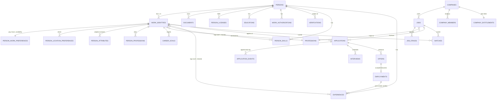

# A3 — Omelo Database Architecture

**Phase 1 architecture document 3 of 4**
**Status:** Deployed and live
**Complete table reference:** [A3-database-tables.md](A3-database-tables.md)

| | |
|---|---|
| Project ref | `jfyqnlucoraazjkndbvm` |
| Region | `ap-southeast-1` |
| Postgres | 17.6 |
| Schema | `public` |
| Tables | **87**, RLS enabled on all 87 |
| Indexes | 229 |
| Check constraints | 34 |
| Triggers | 25 |
| Enums | 40 |
| Extensions | `pgcrypto`, `pg_trgm`, `unaccent`, `vector`, `postgis`, `moddatetime` |
| Migrations applied | 14 |

> **The live database is the source of truth.** This document explains the model and the
> invariants. The generated reference in [A3-database-tables.md](A3-database-tables.md) lists
> every column, key, foreign key and default, and is regenerated from `information_schema`
> rather than hand-maintained.

---

## 1. Migration history

| # | Migration | Contents |
|---|---|---|
| 01 | `omelo_01_extensions_and_enums` | Extensions and ~35 enums covering every work shape |
| 02 | `omelo_02_taxonomy` | Locations, country policies, categories, professions, skills, licences, adaptive `profile_attributes` |
| 03 | `omelo_03_person_work_identity` | Person, preferences, skills, experience, education, licences, documents, verification |
| 04 | `omelo_04_company` | Companies, locations, departments, members, entitlements |
| 05 | `omelo_05_jobs` | The universal job model, requirements, benefits, stages, legal-restriction guard, ingestion |
| 06 | `omelo_06_applications_hiring_loop` | Applications, events, interviews, scorecards, assessments, offers, employments, matches |
| 07 | `omelo_07_messaging_trust_platform` | Conversations, notes, consent edges, notifications, reports, admin, audit |
| 08 | `omelo_08_rls_policies` | Helper predicates and RLS on every table |
| 09 | `omelo_09_seed_taxonomy` | 34 categories, 92 professions, 27 adaptive attributes, 10 licence types, 20 languages, 14 country policies |
| 10 | `omelo_10_auth_functions_grants` | Signup trigger, adaptive profile resolver, nearby-jobs search, grants |
| 11 | `omelo_11_lock_down_function_surface` | Function-surface hardening |
| **12** | **`omelo_12_work_identities`** | **Multiple work identities per person** |
| **13** | **`omelo_13_work_identity_functions_and_rls`** | **Two-level consent, per-identity adaptive schema, RLS** |
| **14** | **`omelo_14_revoke_rls_auto_enable`** | Removed an internal helper from the public API surface |

---

## 2. The multiple-work-identity model

A person can be a teacher **and** a freelance designer. A driver **and** a mechanic. A software
engineer **and** a consultant. This is normal, and conventional job portals cannot represent it.

### 2.1 The decision: a lens, not a duplicate

A work identity is a **lens over one shared person**, not a second person record.

```
                        PERSON  (one human, one account)
                          |
     +--------------------+--------------------+
     |                    |                    |
  SHARED FACTS      WORK IDENTITY 1      WORK IDENTITY 2
  never duplicated   "Teacher"            "Freelance Designer"
     |                    |                    |
  name, contact      profession           profession
  documents          headline / about     headline / about
  licences           pay expectation      pay expectation
  credentials        availability         availability
  languages          shift preference     shift preference
  education          locations            locations
  work auth          adaptive attributes  adaptive attributes
  verifications      DISCOVERABILITY      DISCOVERABILITY
  blocks             career goals         career goals
  notif. prefs       saved searches       saved searches
```

**Why a lens and not a duplicate.** A driver-mechanic holds *one* driving licence, *one* set of
documents, *one* verified identity. Duplicating those per identity would double the verification
burden, create two records that drift apart, and make "which copy is authoritative?" a question
the product can never answer. What genuinely differs between identities is what the person
*wants* — pay, hours, shift, location — and what they are *willing to be found for*.

**The payoff is discoverability.** A teacher can be discoverable as a freelance designer while
remaining invisible as a teacher, so their school never finds them in talent search. That single
capability is worth the whole model, and it is impossible without per-identity consent.

### 2.2 Column placement

| Placement | Tables |
|---|---|
| **Identity-scoped** (`work_identity_id` NOT NULL) | `person_work_preferences` (PK), `person_location_preferences`, `person_attributes`, `person_professions` (PK), `career_goals` |
| **Person-scoped, optionally identity-tagged** (`work_identity_id` NULL = shared across all identities) | `person_skills`, `experiences`, `projects`, `saved_searches` |
| **Marketplace, identity-anchored** | `applications` (NOT NULL), `matches` (NOT NULL), `profile_views`, `talent_pool_members`, `candidate_invitations` |
| **Person-scoped only** (never duplicated) | `documents`, `person_licenses`, `person_credentials`, `person_languages`, `educations`, `work_authorizations`, `person_references`, `verifications`, `blocks`, `follows`, `notification_preferences`, `saved_jobs`, `hidden_jobs` |

`NULL work_identity_id` on skills, experiences and projects means **shared** — it appears under
every identity. That is the right default: most skills genuinely serve both identities, and
forcing a choice on every row would be tedious and wrong.

### 2.3 Invariants enforced in the database

| Invariant | Mechanism |
|---|---|
| Every person has exactly one primary identity | `work_identities_one_primary` partial unique index + `omelo_guard_work_identity()` sets the first identity primary + `omelo_single_primary_identity()` demotes the others |
| Signup always produces a usable identity | `omelo_handle_new_user()` creates `'My work'` and its preferences row |
| At most 5 identities per person | `omelo_guard_work_identity()` |
| `person_id` and `work_identity_id` can never disagree | `omelo_check_identity_owner()` on 11 tables; it overwrites `person_id` from the identity's true owner and raises on mismatch |
| Identity labels are unique per person | `work_identities_label_unique` |

`person_id` is deliberately retained alongside `work_identity_id` so that **every pre-existing
RLS policy keeps working as a single indexed comparison** rather than a join. The denormalisation
is guarded by a trigger, so it cannot drift.

### 2.4 Verified against the live database

```
A. signup created primary identity = true
B. identities=2  primary_count=1
C. prefs: Freelance Designer -> 1500.00/day | Teacher -> 45000.00/month
D. owner guard fired OK          (rejected a foreign work_identity_id)
E. cap fired                     (6th identity rejected)
F. Freelance Designer=discoverable | Teacher=private
```

Line C is the point of the whole model: one person, two genuinely different pay expectations.
Line F is the trust payoff: findable as a designer, invisible as a teacher.

---

## 3. Domain map

87 tables in nine groups.

| Group | Tables | Count |
|---|---|---|
| **Taxonomy** | `job_categories`, `professions`, `profession_aliases`, `profession_skills`, `profession_transitions`, `skills`, `skill_aliases`, `skill_relations`, `profile_attributes`, `license_types`, `credential_types`, `institutions`, `industries`, `languages`, `locations`, `country_policies` | 16 |
| **Person & work identity** | `persons`, `work_identities`, `person_work_preferences`, `person_location_preferences`, `person_professions`, `person_skills`, `person_attributes`, `experiences`, `educations`, `projects`, `project_skills`, `person_licenses`, `person_credentials`, `person_languages`, `person_references`, `work_authorizations`, `career_goals` | 17 |
| **Documents & verification** | `documents`, `document_shares`, `verifications` | 3 |
| **Company** | `companies`, `company_locations`, `company_members`, `company_invitations`, `company_entitlements`, `departments` | 6 |
| **Jobs** | `jobs`, `job_skills`, `job_languages`, `job_licenses`, `job_credentials`, `job_benefits`, `job_locations`, `job_stages`, `job_questions`, `job_attribute_requirements`, `job_documents_required`, `job_legal_restrictions`, `job_sources`, `ingestion_runs` | 14 |
| **Hiring loop** | `applications`, `application_events`, `application_notes`, `interviews`, `interview_interviewers`, `interview_scorecards`, `assessments`, `offers`, `employments` | 9 |
| **Matching** | `matches`, `weight_profiles` | 2 |
| **Engagement** | `conversations`, `messages`, `notifications`, `notification_preferences`, `saved_jobs`, `hidden_jobs`, `saved_searches`, `follows`, `blocks`, `profile_views`, `talent_pools`, `talent_pool_members`, `candidate_invitations` | 13 |
| **Trust & platform** | `reports`, `moderation_actions`, `fraud_signals`, `platform_admins`, `support_sessions`, `audit_log`, `automated_decision_log` | 7 |

### 3.1 Core ERD — identity to hire



### 3.2 The closing loop

The last two relationships above are the product's compounding advantage:

```
Job -> Application -> Interview -> Offer -> Employment
                                                |
                            omelo_employment_to_experience()
                                                |
                                   verified Experience row
                                   + Verification record
                                                |
                                   more employable next time
```

An Omelo hire becomes verified work history automatically. Nobody has to claim it, and no
employer has to confirm it after the fact — the hire *is* the proof. For a worker with no
resume and no degree, this is the only credential ladder they have ever been offered.

### 3.3 Universal job model

One job table serves a hospital consultant and a daily-wage labourer. `jobs` has 66 columns
because the difference between those two jobs is data, not schema:

| Dimension | Columns |
|---|---|
| What work | `title`, `profession_id`, `category_id`, `description`, `responsibilities` |
| Where | `location_id`, `location_text`, `geo`, `country_code`, `workplace_type`, `relocation_support` |
| When | `work_type`, `shift_types`, `hours_per_week`, `working_days`, `start_date`, `is_immediate_start`, `duration_months` |
| How much | `pay_min`, `pay_max`, `pay_period`, `pay_currency`, `pay_basis`, `pay_negotiable`, `overtime_available` |
| Who can do it | `min_experience_months`, `accepts_no_experience`, `min_education`, `education_negotiable`, plus `job_skills`, `job_licenses`, `job_languages`, `job_credentials`, `job_attribute_requirements` |
| Conditions | `physical_requirements`, `work_environment`, `uniform_required`, `own_tools_required`, `own_vehicle_required` |
| Authorisation | `visa_sponsorship`, `accepts_non_residents` |
| How to apply | `application_method`, `quick_apply_enabled`, `requires_resume`, `contact_phone`, `walk_in_details`, `external_apply_url` |

`accepts_no_experience`, `quick_apply_enabled`, `walk_in_details` and `contact_phone` are the
columns that make this a universal platform rather than a white-collar board with a blue-collar
tab. `requires_resume` defaults to **false**.

---

## 4. Enum catalogue

40 enums. The breadth here is what lets one schema cover every kind of work.

| Enum | Values |
|---|---|
| `work_type` | full_time, part_time, contract, freelance, temporary, internship, apprenticeship, seasonal, **gig**, volunteer, **daily_wage** |
| `workplace_type` | onsite, hybrid, remote, **field_based**, **client_site**, **multiple_sites** |
| `shift_type` | day, evening, night, early_morning, rotating, split, flexible, weekend, on_call |
| `pay_period` | hour, day, week, fortnight, month, year, **per_task** |
| `pay_basis` | gross, net |
| `availability_window` | immediate, within_7_days, within_15_days, within_30_days, within_60_days, within_90_days, flexible, not_available |
| `education_level` | none, primary, secondary, high_school, vocational, certificate, diploma, associate, bachelor, master, doctorate, professional, other |
| `skill_type` | technical, tool, **equipment**, **trade**, **physical**, domain, method, soft, language, **safety**, administrative |
| `proficiency_level` | beginner, basic, intermediate, advanced, expert |
| `evidence_type` | self_declared, experience, project, credential, license, assessment, employer_verified, reference |
| `language_proficiency` | basic, conversational, professional, fluent, native |
| `work_auth_status` | citizen, permanent_resident, work_permit, dependent_visa_work_rights, student_visa_limited, requires_sponsorship, no_right_to_work |
| `benefit_type` | **accommodation**, **transport**, **meals**, health_insurance, life_insurance, visa_sponsorship, **flight_tickets**, relocation_assistance, bonus, overtime_pay, **tips**, commission, paid_leave, sick_leave, parental_leave, training, equipment_provided, uniform_provided, childcare, retirement, stock_options, gym, other |
| `document_type` | resume, cover_letter, government_id, passport, work_permit, driving_license, trade_license, professional_license, education_certificate, professional_certificate, experience_letter, payslip, portfolio, police_clearance, medical_certificate, photo, reference_letter, other |
| `interview_type` | phone, video, in_person, group, **walk_in**, **trial_shift**, **practical_test**, assessment_centre, panel |
| `interview_status` | scheduled, rescheduled, completed, cancelled, no_show_candidate, no_show_employer |
| `interview_recommendation` | reject, hold, advance, strong_advance |
| `application_state` | applied, viewed, shortlisted, screening, assessment, interview, offer, hired, rejected, withdrawn, expired, declined_by_candidate |
| `application_event_type` | created, viewed, stage_changed, shortlisted, message_sent, note_added, document_requested, document_shared, interview_scheduled, interview_completed, assessment_sent, assessment_completed, offer_extended, offer_responded, decision_made, withdrawn, expired |
| `offer_status` | draft, sent, viewed, negotiating, accepted, declined, withdrawn, expired |
| `employment_status` | active, on_notice, ended, terminated |
| `job_status` | draft, pending_review, published, paused, expired, closed, rejected |
| `company_role` | owner, admin, recruiter, hiring_manager, interviewer, hr, finance, viewer |
| `company_size_band` | 1-10 … 10000+ |
| `discoverability` | private, discoverable, public |
| **`work_identity_status`** | **active, paused, archived** |
| `requirement_level` | required, preferred, nice_to_have |
| `attribute_data_type` | text, long_text, number, boolean, single_select, multi_select, date, years, file, location |
| `verification_type` | identity, phone, email, address, education, employment, license, certificate, right_to_work, background_check, reference |
| `verification_status` | unverified, pending, verified, failed, expired, revoked |
| `verification_method` | otp, domain_email, employer_confirmation, document_review, issuer_api, institution_partner, government_api, third_party_provider, manual_admin |
| `notification_type` | job_match, job_alert, saved_search, application_update, recruiter_message, interview_scheduled, interview_reminder, offer_received, document_request, verification_update, career_recommendation, company_update, job_closing_soon, profile_reminder, system |
| `report_reason` | fraud, **payment_request**, discrimination, harassment, misleading_job, fake_company, spam, inappropriate_content, data_misuse, other |
| `report_status` | open, triaging, actioned, dismissed, escalated |
| `moderation_action` | none, warning, content_removed, job_unpublished, account_suspended, account_banned, verification_revoked |
| `message_kind` | text, action, attachment, system |
| `actor_type` | candidate, recruiter, system, admin |
| `source_type` | user, import, inference, admin, partner, employer |
| `taxonomy_status` | active, pending_review, deprecated, merged |
| `relation_kind` | adjacent_to, prerequisite_of, substitutable_for, specialisation_of |

Bolded values are the ones a white-collar-only schema would not have. `daily_wage`, `per_task`,
`accommodation`, `trial_shift`, `walk_in` and `payment_request` are each load-bearing for a
specific worker persona.

---

## 5. Indexes

229 indexes. The ones that carry the product:

| Index | Purpose |
|---|---|
| `jobs_geo_idx` GIST | Nearby-jobs discovery — the primary discovery mode for most workers |
| `persons_geo_idx`, `company_locations_geo_idx`, `locations_geo_idx` GIST | Distance calculation across the graph |
| `jobs_embedding_idx` HNSW | Semantic job retrieval |
| `work_identities_embedding_idx` HNSW | Semantic identity retrieval (per identity, not per person) |
| `skills_embedding_idx`, `professions_embedding_idx` HNSW | Taxonomy resolution |
| `jobs_title_trgm`, `skills_name_trgm`, `professions_name_trgm`, `locations_name_trgm`, `companies_name_trgm`, `institutions_name_trgm` GIN | Fuzzy lexical search and alias matching |
| `matches_person_id_job_id_engine_version_key` UNIQUE | Score reproducibility across engine versions |
| `matches_identity_idx (work_identity_id, score desc)` | Ranked matches per identity |
| `work_identities_one_primary` UNIQUE PARTIAL | Exactly one primary identity per person |
| `work_identities_discoverable_idx` PARTIAL | Talent search only scans consenting identities |
| `applications_stale_idx` PARTIAL | Finds applications going silent, for auto-expiry |

The three vector spaces (`jobs`, `work_identities`, `skills`/`professions`) must share one
embedding model. Changing dimensionality requires re-embedding all of them together — see the
open question in [12](../docs/12-open-questions.md).

---

## 6. Functions

18 functions. Only **three** are reachable from a client.

### 6.1 Client-callable (PostgREST RPC)

| Function | Roles | Security | Purpose |
|---|---|---|---|
| `omelo_nearby_jobs(lat, lng, radius_km, category_id, work_types, limit)` | `anon`, `authenticated` | INVOKER | Distance-sorted discovery. RLS governs results. Callable logged-out so a worker sees real jobs before signing up. |
| `omelo_profile_schema_for(work_identity_id)` | `authenticated` | DEFINER | Adaptive profile fields for one identity. Self-only, admin-overridable. Defaults to the primary identity. |
| `omelo_mark_application_viewed(application_id)` | `authenticated` | DEFINER | The only path to opening an application. Writes the honest `viewed` state. |

### 6.2 Internal predicates (EXECUTE revoked)

`omelo_is_discoverable_to`, `omelo_is_identity_discoverable_to`, `omelo_can_access_job`,
`omelo_is_company_member`, `omelo_has_company_role`, `omelo_has_application_from`,
`omelo_is_interviewer_for`, `omelo_is_platform_admin`.

### 6.3 Trigger bodies (EXECUTE revoked)

`omelo_handle_new_user`, `omelo_sync_application_state`, `omelo_log_application_event`,
`omelo_employment_to_experience`, `omelo_check_legal_restriction`, `omelo_guard_work_identity`,
`omelo_single_primary_identity`, `omelo_check_identity_owner`, `rls_auto_enable`.

> **Security note.** `rls_auto_enable()` was callable over PostgREST by `anon` and
> `authenticated` until migration 14 revoked it. Two advisor warnings remain and are
> **intentional**: `omelo_profile_schema_for` and `omelo_mark_application_viewed` are
> deliberately client-callable `SECURITY DEFINER` functions, each with its own internal
> authorisation check.

---

## 7. Invariants the database enforces by itself

Not conventions the application must remember — structure.

| Invariant | Mechanism |
|---|---|
| Employers cannot invent or hide candidate-visible states | `job_stages.maps_to_state` NOT NULL; `omelo_sync_application_state()` derives `applications.state` on every stage move |
| Application history is immutable | `omelo_log_application_event()` appends; UPDATE/DELETE revoked on `application_events`; no RLS policy exists for them |
| An Omelo hire becomes verified work history | `omelo_employment_to_experience()` on insert into `employments` |
| Gender and age criteria are prohibited by default | `omelo_check_legal_restriction()` raises unless `country_policies` explicitly permits them for that country |
| Sponsorship is never guessed | `jobs.visa_sponsorship` nullable, no default; NULL means unknown |
| Sensitive documents are never auto-shared | Employers reach `documents` only through a live, unrevoked `document_shares` row. Receiving an application grants nothing. |
| Blocking produces absence, not a signal | `blocks` has an owner-only read policy; enforcement lives inside `omelo_is_identity_discoverable_to()` |
| Talent search requires consent **and** verification **and** entitlement | All three are conditions inside `omelo_is_identity_discoverable_to()` |
| A person's identities cannot be cross-contaminated | `omelo_check_identity_owner()` on 11 tables |
| Taxonomy cannot be polluted by users | INSERT/UPDATE/DELETE revoked from `anon` and `authenticated` on all taxonomy tables; new terms land in `*_aliases` as `pending_review` |
| Money is never a bare number | Every pay column paired with currency, period and basis, with CHECK constraints |

---

## 8. Regenerating the reference

The table appendix is generated, not maintained. To refresh it after a migration, run the
generator query in [A3-database-tables.md](A3-database-tables.md) §1 and replace §2.

For local development:

```bash
supabase link --project-ref jfyqnlucoraazjkndbvm
```

```bash
supabase db pull
```

```bash
supabase gen types typescript --project-id jfyqnlucoraazjkndbvm > src/types/database.ts
```

---

## 9. What is still open

| Item | Status |
|---|---|
| Embedding dimensionality | `vector(1536)` is a **placeholder**. Tables are empty, so changing it is still free. It stops being free the moment real data lands. |
| `locations` | Empty. Geospatial discovery cannot ship without a gazetteer for the launch country. |
| `skills` | Empty. Professions are seeded; skills are not. Needs a source covering trades, not only knowledge work. |
| `weight_profiles` | Empty. Per-category match weights need seeding before matching runs. |
| Partitioning | `matches`, `application_events` and `audit_log` will need it. Partition keys already exist as columns. |

---

## Decision log

| Decision | Rationale |
|---|---|
| Work identity is a lens over one person, not a duplicate | One licence, one document vault, one verified identity; duplication creates drift and doubles verification cost |
| Per-identity discoverability, with a person-level master switch | Lets someone be findable as a freelancer while invisible in their day job — the single most valuable trust feature in the model |
| `person_id` retained alongside `work_identity_id` | Every existing RLS policy keeps working as one indexed comparison instead of a join; a trigger prevents drift |
| NULL `work_identity_id` means shared | Most skills and experience genuinely serve both identities; forcing a choice per row would be tedious and wrong |
| Cap of 5 identities | Beyond this it is profile-spam, not a career |
| Applications are identity-anchored and NOT NULL | You apply *as* someone specific; the snapshot must record which |
| Applied to the live database now | Tables held zero user rows; this migration would be a multi-week backfill after launch |
